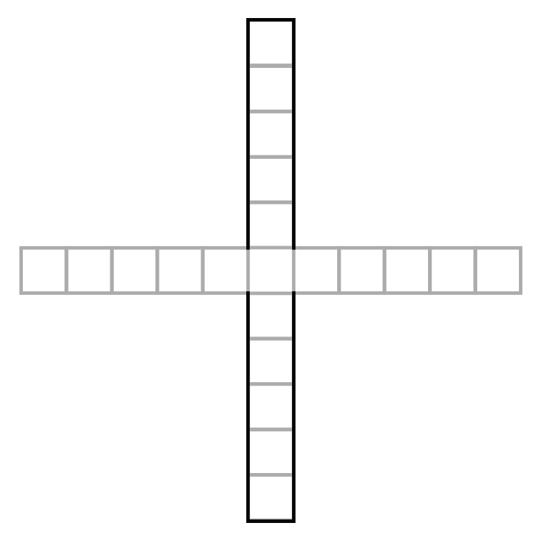

# labRat

## :rocket: ***Title: Decision Making Analyses of Virtual Rats Using Shap Values***

### - :dart: About:

This is an university project that intends to analyse the decision making of  
Virtual Rats using Shap Values, in specific the experiment Labyrinth Cross Elevated  
using Artificial Intelligence.

#### - Elevated Plus Maze (EPM) :rat::

#### - The Article:

>  *  

#### - The Code:

>  *  

### - :shipit: Collaborators:

   Teacher: Ariadne de Andrade Costa  
   Student: Gabriel Souza Silva

:pushpin: __NOTE:__ This project is a graduation project.
